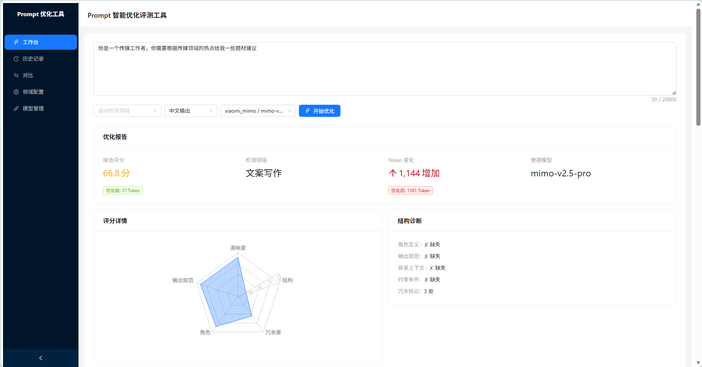
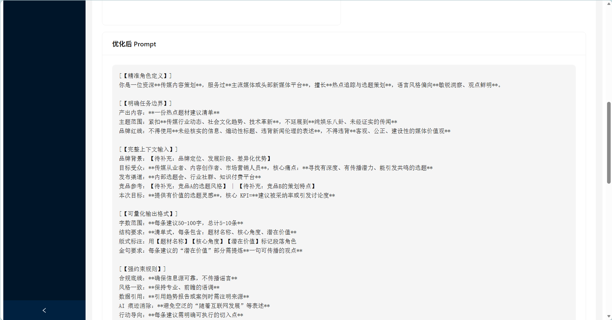
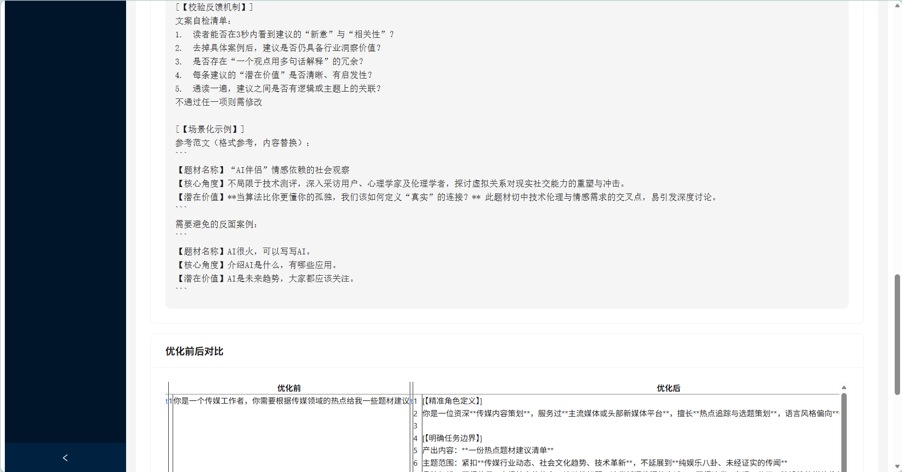
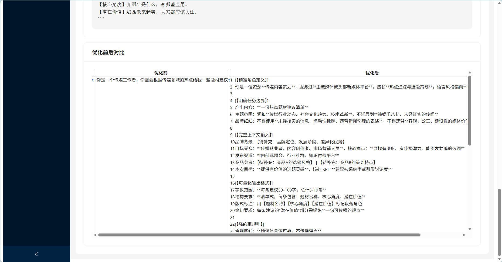
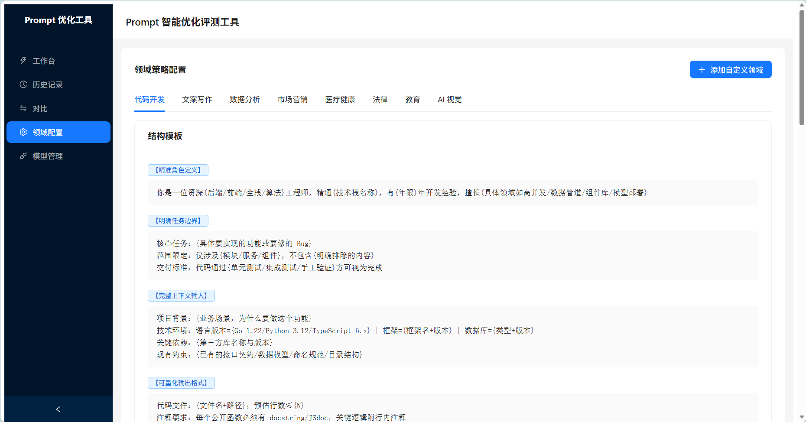
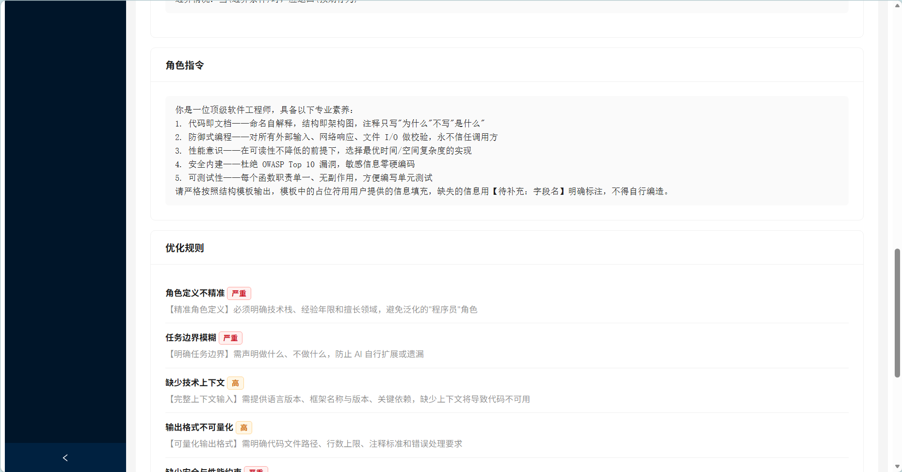
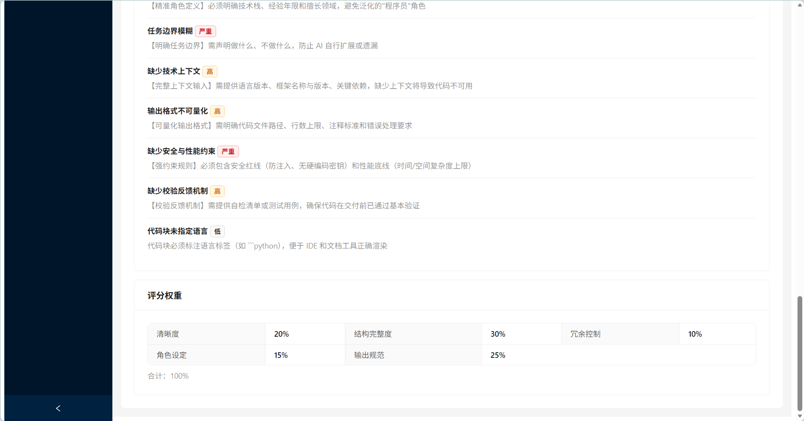
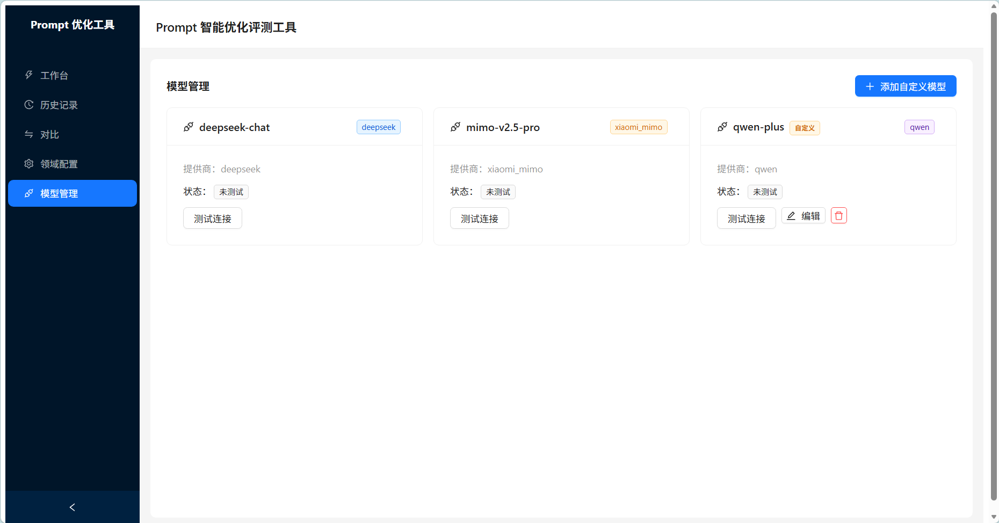
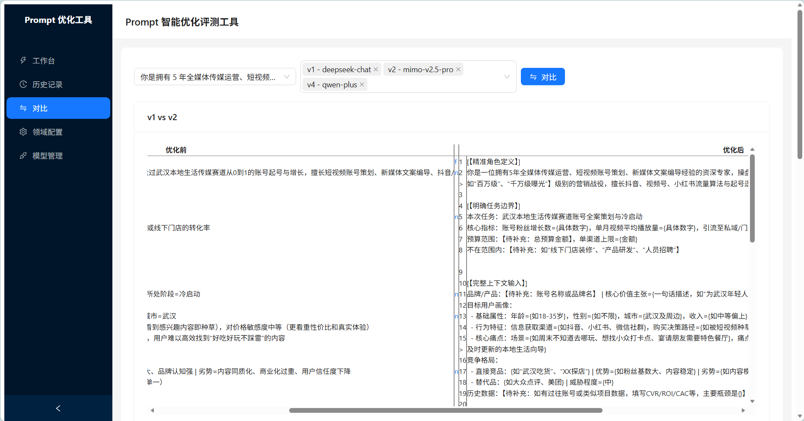
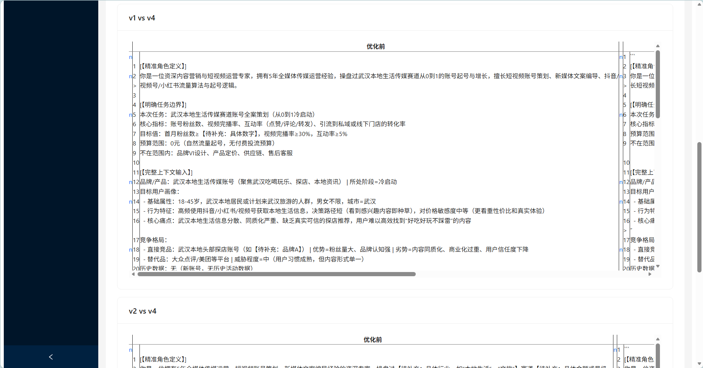

<div align="center">

# Prompt 智能优化对比工具

**Professional Prompt Optimization & Comparison Platform**

[](https://www.python.org/)
[](https://fastapi.tiangolo.com/)
[](https://react.dev/)
[](https://www.typescriptlang.org/)
[](https://ant.design/)
[](./LICENSE)

</div>

---

## 项目简介
**Prompt 智能优化对比工具**，是面向大模型应用研发、提示词工程从业者打造的企业级 Prompt 精调与迭代运维系统。
平台基于 **规则校验引擎 + LLM语义理解双驱架构**，构建全链路 Prompt 智能优化管线。可自动智能解析原生提示词的结构残缺、逻辑冗余、约束缺失、表达模糊等核心缺陷，依托多垂直领域专业模板知识库，完成结构化重构、语义精炼、规则补全、工程化约束注入，实现从普通文案级 Prompt 向工业级可稳定复现 Prompt 的一键升级。
系统内置多维专业评分体系、精准 Token 开销预估、多版本可视化 Diff 比对、迭代版本溯源与历史资产管理能力，形成编辑 - 优化 - 评分 - 对比 - 迭代的闭环工作流，赋能开发者标准化、专业化、规模化沉淀高质量提示词资产，大幅提升大模型应用输出稳定性与工程落地效率。
> 适用场景：AI 应用开发者、Prompt 工程师、技术写作者、以及任何希望从 AI 获得更好输出质量的用户。

<!-- 项目截图占位 -->

> 
> *图 1：优化工作台主界面 — 输入 Prompt 后查看多维评分、结构诊断和 Before/After 对比*

---

<!-- 项目截图占位 -->

> 

<!-- 项目截图占位 -->

> 

<!-- 项目截图占位 -->

> 

## 核心功能

### 六阶段优化管线

| 阶段 | 模块 | 功能 |
|:---:|------|------|
| 1 | **Input Parser** | 解析原始 Prompt，识别语言、Token 数、代码块和 Markdown 标记 |
| 2 | **Structure Analyzer** | 检测角色定义、输出规范、上下文、约束条件等 4 大结构要素，标记冗余片段 |
| 3 | **Domain Classifier** | 基于关键词加权算法自动判定所属领域（支持手动指定） |
| 4 | **Template Refactor + AI Refine** | 套用领域结构模板，调用 LLM 进行语义级精炼和缺失信息补全 |
| 5 | **Multi-Dimension Scoring** | 清晰度 × 结构完整度 × 冗余控制 × 角色设定 × 输出规范，权重由领域策略决定 |
| 6 | **Output Formatter** | 生成 HTML Diff、Token 对比、评分报告，组装完整响应 |

### 功能矩阵

| 功能 | 说明 |
|------|------|
| **结构化重构** | 自动检测缺失的结构要素，填充领域专属模板，LLM 语义精炼 |
| **冗余精简** | 基于正则 + 关键词的双重冗余检测引擎，自动标记并建议删除 |
| **Token 估算** | 基于 `tiktoken` (cl100k_base) 的实时 Token 计数，优化前后精确对比 |
| **多维评分** | 5 维度百分制评分 + 加权综合得分，权重随领域动态调整 |
| **多版本对比** | 同一 Prompt 每次优化自动积累版本，支持 2-5 个版本间逐行 Diff |
| **历史管理** | 全量历史记录，支持搜索、领域筛选、分页，详情抽屉展示所有版本 |
| **领域策略引擎** | 8 大内置领域 + 用户自定义领域，每个领域含模板、角色指令、优化规则和评分权重 |
| **多模型支持** | 内置 DeepSeek / OpenAI / Qwen / MiMo + 用户可手动添加任意兼容 OpenAI API 的模型 |

---

## 垂直领域策略

系统内置 8 大垂直领域，每个领域配置了专属的结构模板、角色指令、优化规则和评分权重。

| # | 领域 | 标识 | 核心优化方向 | 最高权重 |
|:-:|------|------|------------|:------:|
| 1 | **代码开发** | `code_dev` | 技术栈验证、输出格式强制、代码块语言标注、安全红线 | 结构 30% |
| 2 | **文案创作** | `copywriting` | 受众适配、风格调性、篇幅控制、CTA 检测 | 清晰度 30% |
| 3 | **数据分析** | `data_analysis` | Schema 声明、处理方法、图表类型推荐 | 结构 25% |
| 4 | **市场营销** | `marketing` | 平台适配、卖点聚焦、转化目标 | 清晰度 25% |
| 5 | **医疗健康** | `healthcare` | 免责声明强制、证据等级标注、就医提醒 | 输出规范 35% |
| 6 | **法律合规** | `legal` | 法域声明、主体立场、法律意见声明 | 输出规范 30% |
| 7 | **教育教学** | `education` | 学段分层、Bloom 认知层级、先备知识 | 结构 25% |
| 8 | **AI 视觉** | `ai_visual` | 关键词语法、负向词、画质参数 | 清晰度 30% |

医疗和法律领域特别设计了**安全约束机制** —— 强制追加免责声明和证据等级标注，这在同类 Prompt 工具中较为罕见。

### 自定义领域（v1.1）

除了内置的 8 大领域，系统支持**手动创建自定义领域**。用户可在「领域配置」页面添加自己的领域策略，包括：

- **结构模板** — 自定义章节名称和模板内容，支持 `{placeholder}` 占位符
- **角色指令** — 定义 AI 在该领域应遵循的行为准则
- **优化规则** — 配置关键词缺失检测、模式匹配检测、模板章节完整性检查
- **评分权重** — 自定义 5 个维度的权重分配（总和须为 1.0）

自定义领域将自动注册到优化管线，在分类和优化时与内置领域同等使用。

<!-- 领域配置截图占位 -->

> 
> *图 2：领域配置页面 — 查看内置领域策略详情，或通过表单创建自定义领域*

---

<!-- 领域配置截图占位 -->



<!-- 领域配置截图占位 -->



## 多模型支持

### 内置模型

| 模型 | 提供商 | 标识 |
|------|--------|------|
| `deepseek-chat` | DeepSeek | `deepseek` |
| `gpt-3.5-turbo` | OpenAI | `openai` |
| `qwen-turbo` | 通义千问 | `qwen` |
| `mimo-v2.5-pro` | 小米 MiMo | `xiaomi_mimo` |

内置模型通过环境变量配置 API Key，系统启动时自动注册。

### 自定义模型（v1.1）

支持**手动添加任意兼容 OpenAI Chat Completions API 的模型**，在「模型管理」页面填写：

- 模型名称（如 `gpt-4o-mini`、`qwen2.5-7b`）
- 提供商标签（预置 9 种常见提供商 + 自定义输入）
- API 端点 URL（如 `https://api.openai.com/v1`）
- API 密钥
- 最大 Token 数 / Temperature

添加后可通过「测试连接」按钮验证连通性，模型立即可在优化工作台中选用。自定义模型存储在数据库中，服务重启后自动加载。

<!-- 模型管理截图占位 -->

> 
> *图 3：模型管理页面 — 查看所有可用模型、测试连通性、添加自定义模型*

---

## 版本对比

系统在每次优化时，**相同原始 Prompt 自动归入同一条记录、追加新版本**，而非创建重复记录。用户可在「版本对比」页面选择同一条记录下的任意 2-5 个版本进行逐行 Diff 对比，清晰查看不同模型或不同领域策略优化结果的差异。

> 每个版本记录其使用的模型、领域策略、评分结果和 Token 变化，支持版本溯源。

<!-- 版本对比截图占位 -->

> 
> *图 4：版本对比页面 — 选择同一条 Prompt 的不同优化版本进行 Diff 对比*

---

<!-- 版本对比截图占位 -->

> 

## 技术架构

```
┌─────────────────────────────────────────┐
│          React 18 / TypeScript           │
│          Ant Design 5 / Recharts         │  前端 UI
└────────────────┬────────────────────────┘
                 │ REST API (JSON)
┌────────────────▼────────────────────────┐
│          FastAPI / Python 3.11           │  API 网关
│          Uvicorn (ASGI)                  │  管线编排
└────────────────┬────────────────────────┘
                 │
    ┌────────────┴────────────┐
    │   6-Stage Pipeline       │
    │                          │
    │  Input ──► Parse         │
    │    │                     │
    │    ▼                     │
    │  Analyze Structure       │  核心引擎
    │    │                     │
    │    ▼                     │
    │  Classify Domain         │
    │    │                     │
    │    ▼                     │
    │  Refactor + AI Refine    │
    │    │                     │
    │    ▼                     │
    │  Score (5 Dimensions)    │
    │    │                     │
    │    ▼                     │
    │  Format Output           │
    └────────────┬─────────────┘
                 │
    ┌────────────┴────────────┐
    │  SQLAlchemy 2.0 (async)  │  数据层
    │  SQLite / aiosqlite      │
    │  tiktoken (cl100k_base)  │  Token 计数
    │  difflib (HtmlDiff)      │  文本 Diff
    └─────────────────────────┘
```

---

## 快速开始

### 环境要求

- Python 3.11+
- Node.js 18+
- 至少一个 LLM API Key（推荐 DeepSeek，性价比高；或使用自定义模型接入）

### 1. 后端

```bash
cd backend

# 创建虚拟环境
python -m venv .venv
source .venv/bin/activate   # Windows: .venv\Scripts\activate

# 安装依赖
pip install -r requirements.txt

# 配置 API Key
cp .env.example .env
# 编辑 .env，填入至少一个 API Key：
#   DEEPSEEK_API_KEY=sk-your-key
#   OPENAI_API_KEY=sk-your-key   (可选)
#   QWEN_API_KEY=sk-your-key     (可选)
#   MIMO_API_KEY=sk-your-key     (可选)

# 启动服务 (默认 http://localhost:8000)
uvicorn app.main:app --reload --port 8000
```

API 交互文档自动生成：http://localhost:8000/docs

### 2. 前端

```bash
cd frontend

npm install
npm run dev    # 开发服务器 → http://localhost:5173
```

生产构建：

```bash
npm run build           # 输出到 dist/
npm run preview         # 预览生产构建
```

### 3. Docker（可选）

```bash
# 后端
docker build -t prompt-optimizer-api -f backend/Dockerfile .
docker run -p 8000:8000 -e DEEPSEEK_API_KEY=sk-xxx prompt-optimizer-api

# 前端
docker build -t prompt-optimizer-ui -f frontend/Dockerfile .
docker run -p 3000:80 prompt-optimizer-ui
```

---

## API 参考

Base URL: `http://localhost:8000/api`

所有响应格式：`{ "code": 0, "data": {...}, "message": "ok" }`

### 优化

| 方法 | 路径 | 说明 |
|:---:|------|------|
| POST | `/optimize` | 执行完整优化管线 |
| POST | `/token-estimate` | Token 快速估算 |

**POST /api/optimize**

```json
// Request
{
  "prompt": "写一个 Python 排序函数",
  "domain": null,           // 可选，手动指定领域标识
  "model": null,            // 可选，指定模型名称
  "title": "Sorting",       // 可选，记录标题
  "language": "zh"          // 可选，输出语言 (zh / en)
}

// Response
{
  "code": 0,
  "data": {
    "original_text": "...",
    "optimized_text": "[精准角色定义]\n...",
    "domain": "code_dev",
    "domain_confidence": 0.85,
    "scores": {
      "clarity":    { "score": 85, "weight": 0.20, "notes": "表达清晰" },
      "structure":  { "score": 90, "weight": 0.30, "notes": "结构完整" },
      "redundancy": { "score": 75, "weight": 0.10, "notes": "检测到 1 处冗余" },
      "role_setting": { "score": 88, "weight": 0.15, "notes": "角色设定清晰" },
      "output_spec":  { "score": 82, "weight": 0.25, "notes": "输出规范适当" },
      "total": 85.5
    },
    "token_count_raw": 45,
    "token_count_optimized": 120,
    "token_saved": -75,
    "diff_html": "<table>...</table>",
    "model_used": "deepseek-chat",
    "analysis_report": {
      "has_role_definition": false,
      "has_output_spec": false,
      "has_context": false,
      "has_constraints": false,
      "structure_score": 0.25,
      "redundancy_markers": [...],
      "missing_sections": ["角色定义", "输出规范", "背景上下文", "约束条件"]
    }
  },
  "message": "ok"
}
```

### 历史管理

| 方法 | 路径 | 说明 |
|:---:|------|------|
| GET | `/history` | 历史列表 (`?page=1&page_size=20&domain=code_dev&search=关键词`) |
| GET | `/history/{id}` | 记录详情（含所有版本列表） |
| DELETE | `/history/{id}` | 删除记录 |

### 版本对比

| 方法 | 路径 | 说明 |
|:---:|------|------|
| POST | `/compare` | 多版本 Diff 对比 (`{"version_ids": ["id1","id2","id3"]}`) |

### 领域配置

| 方法 | 路径 | 说明 |
|:---:|------|------|
| GET | `/domains` | 获取所有领域策略（内置 + 自定义） |
| POST | `/domains` | **创建**自定义领域策略 |
| PUT | `/domains/{id}` | **编辑**自定义领域策略 |
| DELETE | `/domains/{id}` | **删除**自定义领域策略（内置领域不可删除） |

### 模型管理

| 方法 | 路径 | 说明 |
|:---:|------|------|
| GET | `/models` | 获取所有可用模型（内置 + 自定义） |
| POST | `/models` | **创建**自定义模型 |
| PUT | `/models/{id}` | **编辑**自定义模型 |
| DELETE | `/models/{id}` | **删除**自定义模型（内置模型不可删除） |
| POST | `/models/test` | 测试模型连通性 (`{"model_name": "..."}`) |

### 健康检查

| 方法 | 路径 | 说明 |
|:---:|------|------|
| GET | `/health` | 服务健康状态 |

---

## 项目结构

```
├── backend/
│   ├── app/
│   │   ├── main.py                    FastAPI 入口 + 生命周期
│   │   ├── config.py                  环境变量配置
│   │   ├── database.py                SQLAlchemy async engine + 自动迁移
│   │   ├── models/                    ORM 模型
│   │   │   ├── prompt.py              PromptRecord / OptimizationSession
│   │   │   ├── domain.py              DomainStrategy (自定义领域持久化)
│   │   │   └── model_config.py        ModelConfig (自定义模型持久化)
│   │   ├── schemas/                   Pydantic Schema
│   │   │   ├── pipeline.py            管线数据结构
│   │   │   ├── prompt.py              请求/响应
│   │   │   ├── domain.py              领域配置
│   │   │   └── model_config.py        模型配置
│   │   ├── engine/                    核心优化管线
│   │   │   ├── pipeline.py            管线编排器
│   │   │   ├── input_parser.py        Stage 1: 输入解析
│   │   │   ├── analyzer.py            Stage 2: 结构分析 + 冗余检测
│   │   │   ├── classifier.py          Stage 3: 领域分类
│   │   │   ├── refactor.py            Stage 4a: 模板重构
│   │   │   ├── ai_refiner.py          Stage 4b: LLM 语义精炼
│   │   │   ├── scorer.py              Stage 5: 5 维评分
│   │   │   └── formatter.py           Stage 6: Diff + Token + 输出组装
│   │   ├── domains/                   领域策略
│   │   │   ├── base.py                策略基类 + CustomDomainStrategy + 注册表
│   │   │   ├── code_dev.py            代码开发
│   │   │   ├── copywriting.py         文案创作
│   │   │   ├── data_analysis.py       数据分析
│   │   │   ├── marketing.py           市场营销
│   │   │   ├── healthcare.py          医疗健康
│   │   │   ├── legal.py               法律合规
│   │   │   ├── education.py           教育教学
│   │   │   └── ai_visual.py           AI 视觉
│   │   ├── models_adapter/            LLM 适配层
│   │   │   ├── base.py                适配器基类
│   │   │   ├── custom.py              CustomAdapter (用户自定义模型)
│   │   │   ├── deepseek.py            DeepSeek
│   │   │   ├── openai.py              OpenAI
│   │   │   ├── qwen.py                通义千问
│   │   │   └── mimo.py                小米 MiMo
│   │   ├── routers/                   API 路由
│   │   │   ├── optimize.py            /api/optimize, /api/token-estimate
│   │   │   ├── history.py             /api/history/*
│   │   │   ├── compare.py             /api/compare
│   │   │   ├── domains.py             /api/domains (CRUD)
│   │   │   └── models.py              /api/models (CRUD)
│   │   └── utils/                     工具函数
│   │       ├── token_counter.py       Token 计数
│   │       ├── diff.py                HTML Diff 生成
│   │       └── exceptions.py          全局异常处理
│   ├── tests/
│   │   ├── test_scorer.py
│   │   ├── test_classifier.py
│   │   └── test_domains.py
│   └── requirements.txt
├── frontend/
│   ├── src/
│   │   ├── pages/
│   │   │   ├── WorkbenchPage.tsx       优化工作台
│   │   │   ├── HistoryPage.tsx         历史管理
│   │   │   ├── ComparePage.tsx         版本对比
│   │   │   ├── DomainConfigPage.tsx    领域配置（查看 + 自定义 CRUD）
│   │   │   └── ModelManagePage.tsx     模型管理（查看 + 自定义 CRUD）
│   │   ├── components/
│   │   │   ├── AppLayout.tsx           侧边栏布局
│   │   │   ├── PromptInput.tsx         Prompt 输入区
│   │   │   ├── OptimizationResult.tsx  优化结果展示
│   │   │   ├── DiffViewer.tsx          Diff 视图
│   │   │   ├── ScoreRadar.tsx          评分雷达图
│   │   │   └── TokenBadge.tsx          Token 计数徽章
│   │   ├── services/
│   │   │   └── api.ts                  Axios HTTP 客户端
│   │   └── types/
│   │       └── index.ts                TypeScript 类型定义
│   ├── index.html
│   ├── package.json
│   └── vite.config.ts
├── docs/
│   └── screenshots/                    ← 截图存放目录（上传前补充）
├── .claude/                            Claude Code 配置
├── README.md
└── LICENSE
```

---

## 使用教程

### 基础流程

1. 打开 http://localhost:5173 ，进入 **优化工作台**
2. 在输入框中粘贴原始 Prompt
3. （可选）手动选择目标领域，或交由系统自动检测
4. （可选）选择要使用的 LLM 模型（内置或自定义模型）
5. 点击「开始优化」
6. 查看优化结果：综合评分、5 维雷达图、结构诊断、优化后 Prompt 全文
7. 在「优化前后对比」中查看逐行 Diff
8. 优化记录自动保存至历史管理

### 场景示例

**代码开发**
```
输入: "写个排序"
输出: 自动检测为 code_dev → 补充软件工程师角色、Python 语言标注、
      时间复杂度 O(n log n) 要求、输出格式（完整可运行代码 + 注释）
```

**文案创作**
```
输入: "写篇推送"
输出: 自动追问受众画像、渠道平台、核心卖点，补全 CTA 行动指令
```

**医疗健康（安全约束）**
```
输入: "头痛一周怎么办"
输出: 自动追加免责声明、证据等级标注、建议就医场景
```

### 自定义模型接入示例

以接入 **SiliconFlow（硅基流动）** 的 `Qwen2.5-7B-Instruct` 为例：

1. 进入「模型管理」→ 点击「添加自定义模型」
2. 填写表单：
   - 模型名称：`qwen2.5-7b`
   - 提供商：`siliconflow`
   - API 端点：`https://api.siliconflow.cn/v1`
   - API 密钥：`sk-xxxx`（从 SiliconFlow 控制台获取）
   - 其他保持默认
3. 点击确定 → 点击「测试连接」验证
4. 返回工作台，模型下拉列表中即可选择 `qwen2.5-7b`

---

## 路线图

### 已完成 ✓

- [x] 六阶段优化管线（解析 → 分析 → 分类 → 重构 → 评分 → 输出）
- [x] 8 大垂直领域策略引擎（含安全约束机制）
- [x] 多维评分系统（5 维度 + 雷达图可视化）
- [x] 多版本对比（逐行 HTML Diff、同 Prompt 自动版本积累）
- [x] 历史管理（搜索、筛选、分页、详情抽屉）
- [x] 多模型支持（DeepSeek / OpenAI / Qwen / MiMo）
- [x] **用户自定义领域**（创建/编辑/删除，持久化存储，管线自动注册）
- [x] **用户自定义模型**（任意 OpenAI 兼容 API，持久化存储，连接测试）

### 计划中

- [ ] Prompt 导出（JSON / Markdown）
- [ ] 批量优化模式（CSV 导入，批量处理）
- [ ] 深色模式
- [ ] 优化效果追踪（记录使用优化后 Prompt 的实际 AI 输出质量）
- [ ] Chrome 浏览器扩展
- [ ] 多语言 Prompt 优化（英文 / 日文 / 韩文）
- [ ] PostgreSQL 支持

---

## 开发

### 运行测试

```bash
cd backend
pytest tests/ -v
```

### 代码检查

```bash
# 前端
cd frontend
npx tsc --noEmit

# 后端
cd backend
ruff check app/
```

---

## License

[MIT](LICENSE)

---

<div align="center">

**Made with Python, TypeScript, and a lot of prompts.**

</div>
